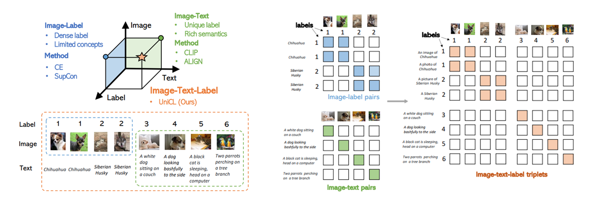

# [Unified Contrastive Learning in Image-Text-Label Space](https://arxiv.org/abs/2204.03610)

This is the official Pytorch implementation of UniCL:

["**Unifiled Contrastive Learning in Image-Text-Label Space. CVPR 2022**"](https://arxiv.org/abs/2204.03610) by [Jianwei Yang*](https://jwyang.github.io/), [Chunyuan Li*](https://chunyuan.li/), [Pengchuan Zhang*](https://pzzhang.github.io/pzzhang/), [Bin Xiao*](https://www.microsoft.com/en-us/research/people/bixi/), [Ce Liu](http://people.csail.mit.edu/celiu/), [Lu Yuan](https://scholar.google.com/citations?user=k9TsUVsAAAAJ&hl=en) and [Jianfeng Gao](https://www.microsoft.com/en-us/research/people/jfgao/?from=http%3A%2F%2Fresearch.microsoft.com%2Fen-us%2Fum%2Fpeople%2Fjfgao%2F).

## Introduction

  

In this paper, we introduce a new perspective on commonly used image-label and image-text data by residing them in an image-text-label space. In this space, a new learning paradigm, called **Unified Contrastive Learning (UniCL)** with a single learning objective is proposed to seamlessly prompt the synergy of two data types. We demonstrate that UniCL is an effective way of learning **semantically rich yet discriminative representations**, universally for image recognition in zero-shot, linear-probe, fully finetuning and transfer learning scenarios. When scaled up to billions of data, UniCL can exclusively learn a powerful visual-semantic representation supporting dozens of downstream tasks shown in [Florence](https://arxiv.org/pdf/2111.11432v1.pdf). We will release our code and ckpts. Stay tunned!

## Checklist

- [ ] Pretrained model and zero-shot evaluation
- [ ] Pretraining code on image-label and image-text data
- [ ] Downstream task transfer (COCO detection)

## Citation

If you find this repo useful to your project, please consider to cite it with following bib:

    @misc{yang2022unified,
        title={Unified Contrastive Learning in Image-Text-Label Space}, 
        author={Jianwei Yang and Chunyuan Li and Pengchuan Zhang and Bin Xiao and Ce Liu and Lu Yuan and Jianfeng Gao},
        year={2022},
        eprint={2204.03610},
        archivePrefix={arXiv},
        primaryClass={cs.CV}
    }

## Acknowledgement

Our codebase is built based on [Swin Transformer](https://github.com/microsoft/Swin-Transformer), [Focal Transformer](https://github.com/microsoft/Focal-Transformer) and [FocalNet](https://github.com/microsoft/FocalNet).

## Contributing

This project welcomes contributions and suggestions.  Most contributions require you to agree to a
Contributor License Agreement (CLA) declaring that you have the right to, and actually do, grant us
the rights to use your contribution. For details, visit https://cla.opensource.microsoft.com.

When you submit a pull request, a CLA bot will automatically determine whether you need to provide
a CLA and decorate the PR appropriately (e.g., status check, comment). Simply follow the instructions
provided by the bot. You will only need to do this once across all repos using our CLA.

This project has adopted the [Microsoft Open Source Code of Conduct](https://opensource.microsoft.com/codeofconduct/).
For more information see the [Code of Conduct FAQ](https://opensource.microsoft.com/codeofconduct/faq/) or
contact [opencode@microsoft.com](mailto:opencode@microsoft.com) with any additional questions or comments.

## Trademarks

This project may contain trademarks or logos for projects, products, or services. Authorized use of Microsoft 
trademarks or logos is subject to and must follow 
[Microsoft's Trademark & Brand Guidelines](https://www.microsoft.com/en-us/legal/intellectualproperty/trademarks/usage/general).
Use of Microsoft trademarks or logos in modified versions of this project must not cause confusion or imply Microsoft sponsorship.
Any use of third-party trademarks or logos are subject to those third-party's policies.
